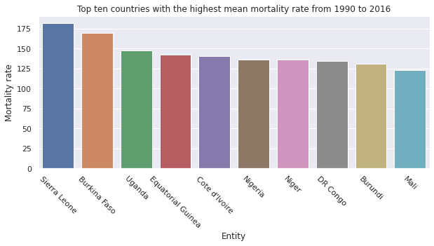
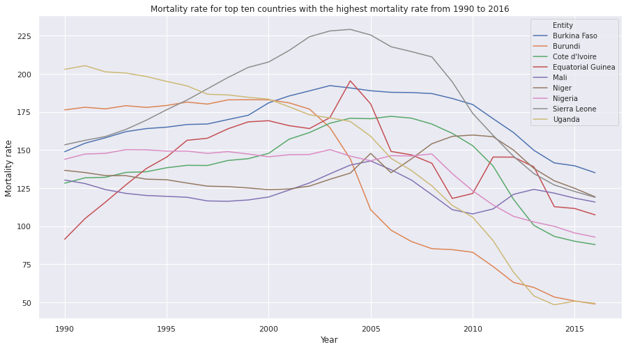
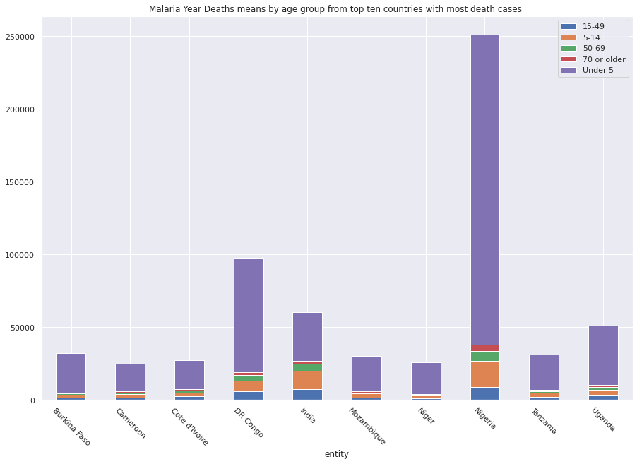
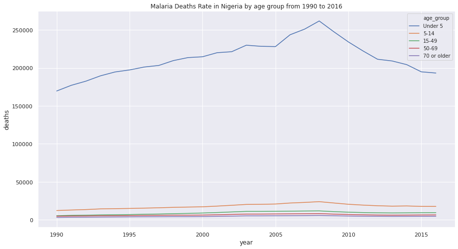
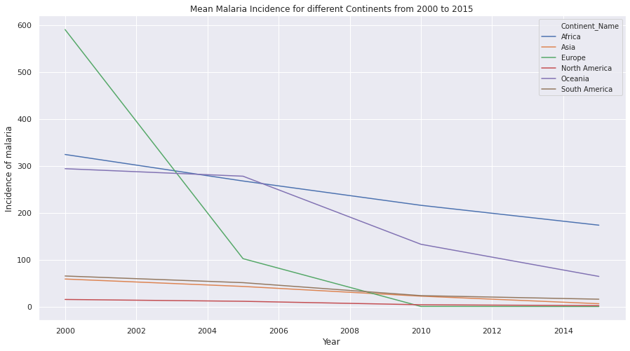

In this blog, I visualized three malaria datasets using Python. The datasets are from here: https://github.com/rfordatascience/tidytuesday/tree/master/data/2018/2018-11-13. 


```python
%matplotlib inline
import matplotlib.pyplot as plt  
```

```python
import pandas as pd
import seaborn as sns 
import numpy as np
```


I first find a outside database about the continent information of countries, which I used in the following visualizations.


```python
df0 = pd.read_csv("https://datahub.io/JohnSnowLabs/country-and-continent-codes-list/r/country-and-continent-codes-list-csv.csv")
df0
```


<div>
<style scoped>
    .dataframe tbody tr th:only-of-type {
        vertical-align: middle;
    }


    .dataframe tbody tr th {
        vertical-align: top;
    }
    
    .dataframe thead th {
        text-align: right;
    }

</style>

<table border="1" class="dataframe">
  <thead>
    <tr style="text-align: right;">
      <th></th>
      <th>Continent_Name</th>
      <th>Continent_Code</th>
      <th>Country_Name</th>
      <th>Two_Letter_Country_Code</th>
      <th>Three_Letter_Country_Code</th>
      <th>Country_Number</th>
    </tr>
  </thead>
  <tbody>
    <tr>
      <th>0</th>
      <td>Asia</td>
      <td>AS</td>
      <td>Afghanistan, Islamic Republic of</td>
      <td>AF</td>
      <td>AFG</td>
      <td>4.0</td>
    </tr>
    <tr>
      <th>1</th>
      <td>Europe</td>
      <td>EU</td>
      <td>Albania, Republic of</td>
      <td>AL</td>
      <td>ALB</td>
      <td>8.0</td>
    </tr>
    <tr>
      <th>2</th>
      <td>Antarctica</td>
      <td>AN</td>
      <td>Antarctica (the territory South of 60 deg S)</td>
      <td>AQ</td>
      <td>ATA</td>
      <td>10.0</td>
    </tr>
    <tr>
      <th>3</th>
      <td>Africa</td>
      <td>AF</td>
      <td>Algeria, People's Democratic Republic of</td>
      <td>DZ</td>
      <td>DZA</td>
      <td>12.0</td>
    </tr>
    <tr>
      <th>4</th>
      <td>Oceania</td>
      <td>OC</td>
      <td>American Samoa</td>
      <td>AS</td>
      <td>ASM</td>
      <td>16.0</td>
    </tr>
    <tr>
      <th>...</th>
      <td>...</td>
      <td>...</td>
      <td>...</td>
      <td>...</td>
      <td>...</td>
      <td>...</td>
    </tr>
    <tr>
      <th>257</th>
      <td>Africa</td>
      <td>AF</td>
      <td>Zambia, Republic of</td>
      <td>ZM</td>
      <td>ZMB</td>
      <td>894.0</td>
    </tr>
    <tr>
      <th>258</th>
      <td>Oceania</td>
      <td>OC</td>
      <td>Disputed Territory</td>
      <td>XX</td>
      <td>NaN</td>
      <td>NaN</td>
    </tr>
    <tr>
      <th>259</th>
      <td>Asia</td>
      <td>AS</td>
      <td>Iraq-Saudi Arabia Neutral Zone</td>
      <td>XE</td>
      <td>NaN</td>
      <td>NaN</td>
    </tr>
    <tr>
      <th>260</th>
      <td>Asia</td>
      <td>AS</td>
      <td>United Nations Neutral Zone</td>
      <td>XD</td>
      <td>NaN</td>
      <td>NaN</td>
    </tr>
    <tr>
      <th>261</th>
      <td>Asia</td>
      <td>AS</td>
      <td>Spratly Islands</td>
      <td>XS</td>
      <td>NaN</td>
      <td>NaN</td>
    </tr>
  </tbody>
</table>
<p>262 rows × 6 columns</p>

</div>


```python
dfc = (
    df0.iloc[:,[0,4]].
    dropna(subset=['Three_Letter_Country_Code']).
    drop_duplicates(subset=['Three_Letter_Country_Code'])
)

dfc
```


<div>
<style scoped>
    .dataframe tbody tr th:only-of-type {
        vertical-align: middle;
    }


    .dataframe tbody tr th {
        vertical-align: top;
    }
    
    .dataframe thead th {
        text-align: right;
    }

</style>

<table border="1" class="dataframe">
  <thead>
    <tr style="text-align: right;">
      <th></th>
      <th>Continent_Name</th>
      <th>Three_Letter_Country_Code</th>
    </tr>
  </thead>
  <tbody>
    <tr>
      <th>0</th>
      <td>Asia</td>
      <td>AFG</td>
    </tr>
    <tr>
      <th>1</th>
      <td>Europe</td>
      <td>ALB</td>
    </tr>
    <tr>
      <th>2</th>
      <td>Antarctica</td>
      <td>ATA</td>
    </tr>
    <tr>
      <th>3</th>
      <td>Africa</td>
      <td>DZA</td>
    </tr>
    <tr>
      <th>4</th>
      <td>Oceania</td>
      <td>ASM</td>
    </tr>
    <tr>
      <th>...</th>
      <td>...</td>
      <td>...</td>
    </tr>
    <tr>
      <th>253</th>
      <td>South America</td>
      <td>VEN</td>
    </tr>
    <tr>
      <th>254</th>
      <td>Oceania</td>
      <td>WLF</td>
    </tr>
    <tr>
      <th>255</th>
      <td>Oceania</td>
      <td>WSM</td>
    </tr>
    <tr>
      <th>256</th>
      <td>Asia</td>
      <td>YEM</td>
    </tr>
    <tr>
      <th>257</th>
      <td>Africa</td>
      <td>ZMB</td>
    </tr>
  </tbody>
</table>
<p>250 rows × 2 columns</p>

</div>

 


### 1. Malaria deaths by country for all ages across the world and time.

- Read the dataset


```python
df1 = pd.read_csv('https://raw.githubusercontent.com/rfordatascience/tidytuesday/master/data/2018/2018-11-13/malaria_deaths.csv')
```


```python
df1 = df1.dropna(subset=['Code']) ## drop those are not countries
df1 = df1[df1['Entity'] != 'World']  ## delete whole world data
df1
```


<div>
<style scoped>
    .dataframe tbody tr th:only-of-type {
        vertical-align: middle;
    }


    .dataframe tbody tr th {
        vertical-align: top;
    }
    
    .dataframe thead th {
        text-align: right;
    }

</style>

<table border="1" class="dataframe">
  <thead>
    <tr style="text-align: right;">
      <th></th>
      <th>Entity</th>
      <th>Code</th>
      <th>Year</th>
      <th>Deaths - Malaria - Sex: Both - Age: Age-standardized (Rate) (per 100,000 people)</th>
    </tr>
  </thead>
  <tbody>
    <tr>
      <th>0</th>
      <td>Afghanistan</td>
      <td>AFG</td>
      <td>1990</td>
      <td>6.802930</td>
    </tr>
    <tr>
      <th>1</th>
      <td>Afghanistan</td>
      <td>AFG</td>
      <td>1991</td>
      <td>6.973494</td>
    </tr>
    <tr>
      <th>2</th>
      <td>Afghanistan</td>
      <td>AFG</td>
      <td>1992</td>
      <td>6.989882</td>
    </tr>
    <tr>
      <th>3</th>
      <td>Afghanistan</td>
      <td>AFG</td>
      <td>1993</td>
      <td>7.088983</td>
    </tr>
    <tr>
      <th>4</th>
      <td>Afghanistan</td>
      <td>AFG</td>
      <td>1994</td>
      <td>7.392472</td>
    </tr>
    <tr>
      <th>...</th>
      <td>...</td>
      <td>...</td>
      <td>...</td>
      <td>...</td>
    </tr>
    <tr>
      <th>6151</th>
      <td>Zimbabwe</td>
      <td>ZWE</td>
      <td>2012</td>
      <td>9.751727</td>
    </tr>
    <tr>
      <th>6152</th>
      <td>Zimbabwe</td>
      <td>ZWE</td>
      <td>2013</td>
      <td>9.419939</td>
    </tr>
    <tr>
      <th>6153</th>
      <td>Zimbabwe</td>
      <td>ZWE</td>
      <td>2014</td>
      <td>9.487453</td>
    </tr>
    <tr>
      <th>6154</th>
      <td>Zimbabwe</td>
      <td>ZWE</td>
      <td>2015</td>
      <td>9.440046</td>
    </tr>
    <tr>
      <th>6155</th>
      <td>Zimbabwe</td>
      <td>ZWE</td>
      <td>2016</td>
      <td>9.507309</td>
    </tr>
  </tbody>
</table>
<p>5265 rows × 4 columns</p>

</div>


- Rename the column names


```python
df1.columns=['Entity', 'Code', 'Year','Mortality rate']
```

- Choose top ten countries with the highest mean mortality rate from 1990 to 2016


```python
df1_m = ( 
    df1.groupby(by="Entity").agg('mean').
    sort_values(by='Mortality rate',ascending=False).
    iloc[:10,1:].copy()
)
```


```python
df1_m = df1_m.reset_index().copy()
df1_m
```


<div>
<style scoped>
    .dataframe tbody tr th:only-of-type {
        vertical-align: middle;
    }


    .dataframe tbody tr th {
        vertical-align: top;
    }
    
    .dataframe thead th {
        text-align: right;
    }

</style>

<table border="1" class="dataframe">
  <thead>
    <tr style="text-align: right;">
      <th></th>
      <th>Entity</th>
      <th>Mortality rate</th>
    </tr>
  </thead>
  <tbody>
    <tr>
      <th>0</th>
      <td>Sierra Leone</td>
      <td>181.658950</td>
    </tr>
    <tr>
      <th>1</th>
      <td>Burkina Faso</td>
      <td>169.667275</td>
    </tr>
    <tr>
      <th>2</th>
      <td>Uganda</td>
      <td>147.281621</td>
    </tr>
    <tr>
      <th>3</th>
      <td>Equatorial Guinea</td>
      <td>142.713265</td>
    </tr>
    <tr>
      <th>4</th>
      <td>Cote d'Ivoire</td>
      <td>140.610546</td>
    </tr>
    <tr>
      <th>5</th>
      <td>Nigeria</td>
      <td>135.902567</td>
    </tr>
    <tr>
      <th>6</th>
      <td>Niger</td>
      <td>135.766525</td>
    </tr>
    <tr>
      <th>7</th>
      <td>Democratic Republic of Congo</td>
      <td>134.571369</td>
    </tr>
    <tr>
      <th>8</th>
      <td>Burundi</td>
      <td>131.296440</td>
    </tr>
    <tr>
      <th>9</th>
      <td>Mali</td>
      <td>122.955185</td>
    </tr>
  </tbody>
</table>

</div>


```python
df1_m['Entity'][7] = "DR Congo"
df1_m
```


<div>
<style scoped>
    .dataframe tbody tr th:only-of-type {
        vertical-align: middle;
    }


    .dataframe tbody tr th {
        vertical-align: top;
    }
    
    .dataframe thead th {
        text-align: right;
    }

</style>

<table border="1" class="dataframe">
  <thead>
    <tr style="text-align: right;">
      <th></th>
      <th>Entity</th>
      <th>Mortality rate</th>
    </tr>
  </thead>
  <tbody>
    <tr>
      <th>0</th>
      <td>Sierra Leone</td>
      <td>181.658950</td>
    </tr>
    <tr>
      <th>1</th>
      <td>Burkina Faso</td>
      <td>169.667275</td>
    </tr>
    <tr>
      <th>2</th>
      <td>Uganda</td>
      <td>147.281621</td>
    </tr>
    <tr>
      <th>3</th>
      <td>Equatorial Guinea</td>
      <td>142.713265</td>
    </tr>
    <tr>
      <th>4</th>
      <td>Cote d'Ivoire</td>
      <td>140.610546</td>
    </tr>
    <tr>
      <th>5</th>
      <td>Nigeria</td>
      <td>135.902567</td>
    </tr>
    <tr>
      <th>6</th>
      <td>Niger</td>
      <td>135.766525</td>
    </tr>
    <tr>
      <th>7</th>
      <td>DR Congo</td>
      <td>134.571369</td>
    </tr>
    <tr>
      <th>8</th>
      <td>Burundi</td>
      <td>131.296440</td>
    </tr>
    <tr>
      <th>9</th>
      <td>Mali</td>
      <td>122.955185</td>
    </tr>
  </tbody>
</table>

</div>


- Plot the bar plot


```python
fig, axes = plt.subplots(1, 1, figsize=(10,4))

g1 = sns.barplot(x='Entity', y='Mortality rate', data=df1_m)
labels = df1_m['Entity']
g1.set_xticklabels(labels,rotation=-45)
plt.title('Top ten countries with the highest mean mortality rate from 1990 to 2016')

pass
```




- Plot the trend of mortality rate of these ten countries


```python
df1_ss = df1[df1['Entity'].isin(df1_m['Entity'])].copy()
df1_ss
```


<div>
<style scoped>
    .dataframe tbody tr th:only-of-type {
        vertical-align: middle;
    }


    .dataframe tbody tr th {
        vertical-align: top;
    }
    
    .dataframe thead th {
        text-align: right;
    }

</style>

<table border="1" class="dataframe">
  <thead>
    <tr style="text-align: right;">
      <th></th>
      <th>Entity</th>
      <th>Code</th>
      <th>Year</th>
      <th>Mortality rate</th>
    </tr>
  </thead>
  <tbody>
    <tr>
      <th>810</th>
      <td>Burkina Faso</td>
      <td>BFA</td>
      <td>1990</td>
      <td>148.890249</td>
    </tr>
    <tr>
      <th>811</th>
      <td>Burkina Faso</td>
      <td>BFA</td>
      <td>1991</td>
      <td>154.470849</td>
    </tr>
    <tr>
      <th>812</th>
      <td>Burkina Faso</td>
      <td>BFA</td>
      <td>1992</td>
      <td>158.051907</td>
    </tr>
    <tr>
      <th>813</th>
      <td>Burkina Faso</td>
      <td>BFA</td>
      <td>1993</td>
      <td>162.043022</td>
    </tr>
    <tr>
      <th>814</th>
      <td>Burkina Faso</td>
      <td>BFA</td>
      <td>1994</td>
      <td>164.068758</td>
    </tr>
    <tr>
      <th>...</th>
      <td>...</td>
      <td>...</td>
      <td>...</td>
      <td>...</td>
    </tr>
    <tr>
      <th>5692</th>
      <td>Uganda</td>
      <td>UGA</td>
      <td>2012</td>
      <td>69.818389</td>
    </tr>
    <tr>
      <th>5693</th>
      <td>Uganda</td>
      <td>UGA</td>
      <td>2013</td>
      <td>54.161004</td>
    </tr>
    <tr>
      <th>5694</th>
      <td>Uganda</td>
      <td>UGA</td>
      <td>2014</td>
      <td>48.320006</td>
    </tr>
    <tr>
      <th>5695</th>
      <td>Uganda</td>
      <td>UGA</td>
      <td>2015</td>
      <td>50.672187</td>
    </tr>
    <tr>
      <th>5696</th>
      <td>Uganda</td>
      <td>UGA</td>
      <td>2016</td>
      <td>49.232941</td>
    </tr>
  </tbody>
</table>
<p>243 rows × 4 columns</p>

</div>


```python
fig, axes = plt.subplots(1, 1, figsize=(15,8))
sns.lineplot(x='Year', y='Mortality rate',hue = 'Entity' , data=df1_ss)
plt.title('Mortality rate for top ten countries with the highest mortality rate from 1990 to 2016')
plt.legend(loc='best', fontsize=10)
pass
```




### 2. Malaria deaths by age across the world and time.

- Read the dataset


```python
df2 = pd.read_csv('https://raw.githubusercontent.com/rfordatascience/tidytuesday/master/data/2018/2018-11-13/malaria_deaths_age.csv',index_col = 0)
df2
```


<div>
<style scoped>
    .dataframe tbody tr th:only-of-type {
        vertical-align: middle;
    }


    .dataframe tbody tr th {
        vertical-align: top;
    }
    
    .dataframe thead th {
        text-align: right;
    }

</style>

<table border="1" class="dataframe">
  <thead>
    <tr style="text-align: right;">
      <th></th>
      <th>entity</th>
      <th>code</th>
      <th>year</th>
      <th>age_group</th>
      <th>deaths</th>
    </tr>
  </thead>
  <tbody>
    <tr>
      <th>1</th>
      <td>Afghanistan</td>
      <td>AFG</td>
      <td>1990</td>
      <td>Under 5</td>
      <td>184.606435</td>
    </tr>
    <tr>
      <th>2</th>
      <td>Afghanistan</td>
      <td>AFG</td>
      <td>1991</td>
      <td>Under 5</td>
      <td>191.658193</td>
    </tr>
    <tr>
      <th>3</th>
      <td>Afghanistan</td>
      <td>AFG</td>
      <td>1992</td>
      <td>Under 5</td>
      <td>197.140197</td>
    </tr>
    <tr>
      <th>4</th>
      <td>Afghanistan</td>
      <td>AFG</td>
      <td>1993</td>
      <td>Under 5</td>
      <td>207.357753</td>
    </tr>
    <tr>
      <th>5</th>
      <td>Afghanistan</td>
      <td>AFG</td>
      <td>1994</td>
      <td>Under 5</td>
      <td>226.209363</td>
    </tr>
    <tr>
      <th>...</th>
      <td>...</td>
      <td>...</td>
      <td>...</td>
      <td>...</td>
      <td>...</td>
    </tr>
    <tr>
      <th>30776</th>
      <td>Zimbabwe</td>
      <td>ZWE</td>
      <td>2012</td>
      <td>50-69</td>
      <td>103.185111</td>
    </tr>
    <tr>
      <th>30777</th>
      <td>Zimbabwe</td>
      <td>ZWE</td>
      <td>2013</td>
      <td>50-69</td>
      <td>100.113293</td>
    </tr>
    <tr>
      <th>30778</th>
      <td>Zimbabwe</td>
      <td>ZWE</td>
      <td>2014</td>
      <td>50-69</td>
      <td>99.013890</td>
    </tr>
    <tr>
      <th>30779</th>
      <td>Zimbabwe</td>
      <td>ZWE</td>
      <td>2015</td>
      <td>50-69</td>
      <td>98.091738</td>
    </tr>
    <tr>
      <th>30780</th>
      <td>Zimbabwe</td>
      <td>ZWE</td>
      <td>2016</td>
      <td>50-69</td>
      <td>97.402058</td>
    </tr>
  </tbody>
</table>
<p>30780 rows × 5 columns</p>

</div>


```python
df2 = df2.dropna(subset=['code']) ## drop those are not countries
df2 = df2[df2['entity'] != 'World']  ## delete whole world data
df2
```


<div>
<style scoped>
    .dataframe tbody tr th:only-of-type {
        vertical-align: middle;
    }


    .dataframe tbody tr th {
        vertical-align: top;
    }
    
    .dataframe thead th {
        text-align: right;
    }

</style>

<table border="1" class="dataframe">
  <thead>
    <tr style="text-align: right;">
      <th></th>
      <th>entity</th>
      <th>code</th>
      <th>year</th>
      <th>age_group</th>
      <th>deaths</th>
    </tr>
  </thead>
  <tbody>
    <tr>
      <th>1</th>
      <td>Afghanistan</td>
      <td>AFG</td>
      <td>1990</td>
      <td>Under 5</td>
      <td>184.606435</td>
    </tr>
    <tr>
      <th>2</th>
      <td>Afghanistan</td>
      <td>AFG</td>
      <td>1991</td>
      <td>Under 5</td>
      <td>191.658193</td>
    </tr>
    <tr>
      <th>3</th>
      <td>Afghanistan</td>
      <td>AFG</td>
      <td>1992</td>
      <td>Under 5</td>
      <td>197.140197</td>
    </tr>
    <tr>
      <th>4</th>
      <td>Afghanistan</td>
      <td>AFG</td>
      <td>1993</td>
      <td>Under 5</td>
      <td>207.357753</td>
    </tr>
    <tr>
      <th>5</th>
      <td>Afghanistan</td>
      <td>AFG</td>
      <td>1994</td>
      <td>Under 5</td>
      <td>226.209363</td>
    </tr>
    <tr>
      <th>...</th>
      <td>...</td>
      <td>...</td>
      <td>...</td>
      <td>...</td>
      <td>...</td>
    </tr>
    <tr>
      <th>30776</th>
      <td>Zimbabwe</td>
      <td>ZWE</td>
      <td>2012</td>
      <td>50-69</td>
      <td>103.185111</td>
    </tr>
    <tr>
      <th>30777</th>
      <td>Zimbabwe</td>
      <td>ZWE</td>
      <td>2013</td>
      <td>50-69</td>
      <td>100.113293</td>
    </tr>
    <tr>
      <th>30778</th>
      <td>Zimbabwe</td>
      <td>ZWE</td>
      <td>2014</td>
      <td>50-69</td>
      <td>99.013890</td>
    </tr>
    <tr>
      <th>30779</th>
      <td>Zimbabwe</td>
      <td>ZWE</td>
      <td>2015</td>
      <td>50-69</td>
      <td>98.091738</td>
    </tr>
    <tr>
      <th>30780</th>
      <td>Zimbabwe</td>
      <td>ZWE</td>
      <td>2016</td>
      <td>50-69</td>
      <td>97.402058</td>
    </tr>
  </tbody>
</table>
<p>26325 rows × 5 columns</p>

</div>


- choose top ten countries with most death cases


```python
df2_t2 = df2[df2['entity'].isin(df2_t['entity'])].copy()
df2_t2
```


<div>
<style scoped>
    .dataframe tbody tr th:only-of-type {
        vertical-align: middle;
    }


    .dataframe tbody tr th {
        vertical-align: top;
    }
    
    .dataframe thead th {
        text-align: right;
    }

</style>

<table border="1" class="dataframe">
  <thead>
    <tr style="text-align: right;">
      <th></th>
      <th>entity</th>
      <th>code</th>
      <th>year</th>
      <th>age_group</th>
      <th>deaths</th>
    </tr>
  </thead>
  <tbody>
    <tr>
      <th>811</th>
      <td>Burkina Faso</td>
      <td>BFA</td>
      <td>1990</td>
      <td>Under 5</td>
      <td>18239.856090</td>
    </tr>
    <tr>
      <th>812</th>
      <td>Burkina Faso</td>
      <td>BFA</td>
      <td>1991</td>
      <td>Under 5</td>
      <td>19262.190962</td>
    </tr>
    <tr>
      <th>813</th>
      <td>Burkina Faso</td>
      <td>BFA</td>
      <td>1992</td>
      <td>Under 5</td>
      <td>20171.050076</td>
    </tr>
    <tr>
      <th>814</th>
      <td>Burkina Faso</td>
      <td>BFA</td>
      <td>1993</td>
      <td>Under 5</td>
      <td>21023.473688</td>
    </tr>
    <tr>
      <th>815</th>
      <td>Burkina Faso</td>
      <td>BFA</td>
      <td>1994</td>
      <td>Under 5</td>
      <td>21625.799178</td>
    </tr>
    <tr>
      <th>...</th>
      <td>...</td>
      <td>...</td>
      <td>...</td>
      <td>...</td>
      <td>...</td>
    </tr>
    <tr>
      <th>30317</th>
      <td>Uganda</td>
      <td>UGA</td>
      <td>2012</td>
      <td>50-69</td>
      <td>1223.126262</td>
    </tr>
    <tr>
      <th>30318</th>
      <td>Uganda</td>
      <td>UGA</td>
      <td>2013</td>
      <td>50-69</td>
      <td>1000.050301</td>
    </tr>
    <tr>
      <th>30319</th>
      <td>Uganda</td>
      <td>UGA</td>
      <td>2014</td>
      <td>50-69</td>
      <td>949.020874</td>
    </tr>
    <tr>
      <th>30320</th>
      <td>Uganda</td>
      <td>UGA</td>
      <td>2015</td>
      <td>50-69</td>
      <td>1083.887084</td>
    </tr>
    <tr>
      <th>30321</th>
      <td>Uganda</td>
      <td>UGA</td>
      <td>2016</td>
      <td>50-69</td>
      <td>1086.361351</td>
    </tr>
  </tbody>
</table>
<p>1350 rows × 5 columns</p>

</div>


```python
df2_t2.loc[df2_t2['entity'] == 'Democratic Republic of Congo','entity'] = 'DR Congo'
```


```python
df2_t3 = df2_t2.groupby(by=["entity","age_group"]).agg('mean').iloc[:,[1]].unstack('age_group')
df2_t3.columns = ['15-49','5-14','50-69','70 or older','Under 5']
df2_t3
```


<div>
<style scoped>
    .dataframe tbody tr th:only-of-type {
        vertical-align: middle;
    }


    .dataframe tbody tr th {
        vertical-align: top;
    }
    
    .dataframe thead th {
        text-align: right;
    }

</style>

<table border="1" class="dataframe">
  <thead>
    <tr style="text-align: right;">
      <th></th>
      <th>15-49</th>
      <th>5-14</th>
      <th>50-69</th>
      <th>70 or older</th>
      <th>Under 5</th>
    </tr>
    <tr>
      <th>entity</th>
      <th></th>
      <th></th>
      <th></th>
      <th></th>
      <th></th>
    </tr>
  </thead>
  <tbody>
    <tr>
      <th>Burkina Faso</th>
      <td>1440.986219</td>
      <td>2180.110659</td>
      <td>949.531799</td>
      <td>616.307888</td>
      <td>27090.929143</td>
    </tr>
    <tr>
      <th>Cameroon</th>
      <td>1841.799877</td>
      <td>2087.751841</td>
      <td>1260.056940</td>
      <td>843.155975</td>
      <td>18920.406820</td>
    </tr>
    <tr>
      <th>Cote d'Ivoire</th>
      <td>2435.445658</td>
      <td>2707.015515</td>
      <td>1540.863000</td>
      <td>961.537118</td>
      <td>19893.376484</td>
    </tr>
    <tr>
      <th>DR Congo</th>
      <td>5865.025596</td>
      <td>7418.616598</td>
      <td>3738.726743</td>
      <td>2173.788505</td>
      <td>78082.393657</td>
    </tr>
    <tr>
      <th>India</th>
      <td>7467.822952</td>
      <td>12800.418534</td>
      <td>4570.759705</td>
      <td>2180.711296</td>
      <td>33569.693452</td>
    </tr>
    <tr>
      <th>Mozambique</th>
      <td>1768.206804</td>
      <td>2589.157880</td>
      <td>942.746073</td>
      <td>646.568790</td>
      <td>24264.110234</td>
    </tr>
    <tr>
      <th>Niger</th>
      <td>1049.787630</td>
      <td>1951.445501</td>
      <td>754.023705</td>
      <td>476.335101</td>
      <td>21820.324927</td>
    </tr>
    <tr>
      <th>Nigeria</th>
      <td>9019.184357</td>
      <td>17961.554380</td>
      <td>6505.248814</td>
      <td>4558.828812</td>
      <td>213128.814854</td>
    </tr>
    <tr>
      <th>Tanzania</th>
      <td>2282.382476</td>
      <td>2561.401544</td>
      <td>1270.799946</td>
      <td>814.388226</td>
      <td>24197.304098</td>
    </tr>
    <tr>
      <th>Uganda</th>
      <td>3213.540577</td>
      <td>4041.199036</td>
      <td>1844.906441</td>
      <td>1290.584647</td>
      <td>40908.586984</td>
    </tr>
  </tbody>
</table>

</div>


```python
df2_t3.plot(kind='bar', stacked=True,figsize=(15, 10),rot = -45, title = "Malaria Year Deaths means by age group from top ten countries with most death cases ")
pass
```





- Choose Nigeria to see the trend of death cases across countries 


```python
df2_nig = df2[df2['entity'] == 'Nigeria' ].copy()
df2_nig
```


<div>
<style scoped>
    .dataframe tbody tr th:only-of-type {
        vertical-align: middle;
    }


    .dataframe tbody tr th {
        vertical-align: top;
    }
    
    .dataframe thead th {
        text-align: right;
    }

</style>

<table border="1" class="dataframe">
  <thead>
    <tr style="text-align: right;">
      <th></th>
      <th>entity</th>
      <th>code</th>
      <th>year</th>
      <th>age_group</th>
      <th>deaths</th>
    </tr>
  </thead>
  <tbody>
    <tr>
      <th>3889</th>
      <td>Nigeria</td>
      <td>NGA</td>
      <td>1990</td>
      <td>Under 5</td>
      <td>169612.233561</td>
    </tr>
    <tr>
      <th>3890</th>
      <td>Nigeria</td>
      <td>NGA</td>
      <td>1991</td>
      <td>Under 5</td>
      <td>177084.049314</td>
    </tr>
    <tr>
      <th>3891</th>
      <td>Nigeria</td>
      <td>NGA</td>
      <td>1992</td>
      <td>Under 5</td>
      <td>182532.593757</td>
    </tr>
    <tr>
      <th>3892</th>
      <td>Nigeria</td>
      <td>NGA</td>
      <td>1993</td>
      <td>Under 5</td>
      <td>189569.206430</td>
    </tr>
    <tr>
      <th>3893</th>
      <td>Nigeria</td>
      <td>NGA</td>
      <td>1994</td>
      <td>Under 5</td>
      <td>194656.088044</td>
    </tr>
    <tr>
      <th>...</th>
      <td>...</td>
      <td>...</td>
      <td>...</td>
      <td>...</td>
      <td>...</td>
    </tr>
    <tr>
      <th>28535</th>
      <td>Nigeria</td>
      <td>NGA</td>
      <td>2012</td>
      <td>50-69</td>
      <td>6362.466362</td>
    </tr>
    <tr>
      <th>28536</th>
      <td>Nigeria</td>
      <td>NGA</td>
      <td>2013</td>
      <td>50-69</td>
      <td>6225.805881</td>
    </tr>
    <tr>
      <th>28537</th>
      <td>Nigeria</td>
      <td>NGA</td>
      <td>2014</td>
      <td>50-69</td>
      <td>6309.529067</td>
    </tr>
    <tr>
      <th>28538</th>
      <td>Nigeria</td>
      <td>NGA</td>
      <td>2015</td>
      <td>50-69</td>
      <td>6436.740885</td>
    </tr>
    <tr>
      <th>28539</th>
      <td>Nigeria</td>
      <td>NGA</td>
      <td>2016</td>
      <td>50-69</td>
      <td>6489.088313</td>
    </tr>
  </tbody>
</table>
<p>135 rows × 5 columns</p>

</div>


```python
fig, axes = plt.subplots(1, 1, figsize=(15,8))
sns.lineplot(x='year', y='deaths',hue = 'age_group', hue_order = ['Under 5','5-14','15-49','50-69','70 or older'] , data=df2_nig)
plt.title('Malaria Deaths Rate in Nigeria by age group from 1990 to 2016')
plt.legend(loc='best', fontsize=10)
pass
```





### 3. Malaria incidence by country for all ages across the world across time

- Read dataset


```python
df3 = pd.read_csv('https://raw.githubusercontent.com/rfordatascience/tidytuesday/master/data/2018/2018-11-13/malaria_inc.csv')
```


```python
df3
```


<div>
<style scoped>
    .dataframe tbody tr th:only-of-type {
        vertical-align: middle;
    }


    .dataframe tbody tr th {
        vertical-align: top;
    }
    
    .dataframe thead th {
        text-align: right;
    }

</style>

<table border="1" class="dataframe">
  <thead>
    <tr style="text-align: right;">
      <th></th>
      <th>Entity</th>
      <th>Code</th>
      <th>Year</th>
      <th>Incidence of malaria (per 1,000 population at risk) (per 1,000 population at risk)</th>
    </tr>
  </thead>
  <tbody>
    <tr>
      <th>0</th>
      <td>Afghanistan</td>
      <td>AFG</td>
      <td>2000</td>
      <td>107.100000</td>
    </tr>
    <tr>
      <th>1</th>
      <td>Afghanistan</td>
      <td>AFG</td>
      <td>2005</td>
      <td>46.500000</td>
    </tr>
    <tr>
      <th>2</th>
      <td>Afghanistan</td>
      <td>AFG</td>
      <td>2010</td>
      <td>23.900000</td>
    </tr>
    <tr>
      <th>3</th>
      <td>Afghanistan</td>
      <td>AFG</td>
      <td>2015</td>
      <td>23.600000</td>
    </tr>
    <tr>
      <th>4</th>
      <td>Algeria</td>
      <td>DZA</td>
      <td>2000</td>
      <td>0.037746</td>
    </tr>
    <tr>
      <th>...</th>
      <td>...</td>
      <td>...</td>
      <td>...</td>
      <td>...</td>
    </tr>
    <tr>
      <th>503</th>
      <td>Zambia</td>
      <td>ZMB</td>
      <td>2015</td>
      <td>173.700000</td>
    </tr>
    <tr>
      <th>504</th>
      <td>Zimbabwe</td>
      <td>ZWE</td>
      <td>2000</td>
      <td>143.200000</td>
    </tr>
    <tr>
      <th>505</th>
      <td>Zimbabwe</td>
      <td>ZWE</td>
      <td>2005</td>
      <td>142.500000</td>
    </tr>
    <tr>
      <th>506</th>
      <td>Zimbabwe</td>
      <td>ZWE</td>
      <td>2010</td>
      <td>129.600000</td>
    </tr>
    <tr>
      <th>507</th>
      <td>Zimbabwe</td>
      <td>ZWE</td>
      <td>2015</td>
      <td>114.200000</td>
    </tr>
  </tbody>
</table>
<p>508 rows × 4 columns</p>

</div>


```python
df3 = df3.dropna(subset=['Code']) ## drop those are not countries
df3 = df3[df3['Entity'] != 'World']  ## delete whole world data
df3
```


<div>
<style scoped>
    .dataframe tbody tr th:only-of-type {
        vertical-align: middle;
    }


    .dataframe tbody tr th {
        vertical-align: top;
    }
    
    .dataframe thead th {
        text-align: right;
    }

</style>

<table border="1" class="dataframe">
  <thead>
    <tr style="text-align: right;">
      <th></th>
      <th>Entity</th>
      <th>Code</th>
      <th>Year</th>
      <th>Incidence of malaria (per 1,000 population at risk) (per 1,000 population at risk)</th>
    </tr>
  </thead>
  <tbody>
    <tr>
      <th>0</th>
      <td>Afghanistan</td>
      <td>AFG</td>
      <td>2000</td>
      <td>107.100000</td>
    </tr>
    <tr>
      <th>1</th>
      <td>Afghanistan</td>
      <td>AFG</td>
      <td>2005</td>
      <td>46.500000</td>
    </tr>
    <tr>
      <th>2</th>
      <td>Afghanistan</td>
      <td>AFG</td>
      <td>2010</td>
      <td>23.900000</td>
    </tr>
    <tr>
      <th>3</th>
      <td>Afghanistan</td>
      <td>AFG</td>
      <td>2015</td>
      <td>23.600000</td>
    </tr>
    <tr>
      <th>4</th>
      <td>Algeria</td>
      <td>DZA</td>
      <td>2000</td>
      <td>0.037746</td>
    </tr>
    <tr>
      <th>...</th>
      <td>...</td>
      <td>...</td>
      <td>...</td>
      <td>...</td>
    </tr>
    <tr>
      <th>503</th>
      <td>Zambia</td>
      <td>ZMB</td>
      <td>2015</td>
      <td>173.700000</td>
    </tr>
    <tr>
      <th>504</th>
      <td>Zimbabwe</td>
      <td>ZWE</td>
      <td>2000</td>
      <td>143.200000</td>
    </tr>
    <tr>
      <th>505</th>
      <td>Zimbabwe</td>
      <td>ZWE</td>
      <td>2005</td>
      <td>142.500000</td>
    </tr>
    <tr>
      <th>506</th>
      <td>Zimbabwe</td>
      <td>ZWE</td>
      <td>2010</td>
      <td>129.600000</td>
    </tr>
    <tr>
      <th>507</th>
      <td>Zimbabwe</td>
      <td>ZWE</td>
      <td>2015</td>
      <td>114.200000</td>
    </tr>
  </tbody>
</table>
<p>396 rows × 4 columns</p>

</div>


```python
df3.columns=['Entity', 'Code', 'Year', 'Incidence of malaria']
df3
```


<div>
<style scoped>
    .dataframe tbody tr th:only-of-type {
        vertical-align: middle;
    }


    .dataframe tbody tr th {
        vertical-align: top;
    }
    
    .dataframe thead th {
        text-align: right;
    }

</style>

<table border="1" class="dataframe">
  <thead>
    <tr style="text-align: right;">
      <th></th>
      <th>Entity</th>
      <th>Code</th>
      <th>Year</th>
      <th>Incidence of malaria</th>
    </tr>
  </thead>
  <tbody>
    <tr>
      <th>0</th>
      <td>Afghanistan</td>
      <td>AFG</td>
      <td>2000</td>
      <td>107.100000</td>
    </tr>
    <tr>
      <th>1</th>
      <td>Afghanistan</td>
      <td>AFG</td>
      <td>2005</td>
      <td>46.500000</td>
    </tr>
    <tr>
      <th>2</th>
      <td>Afghanistan</td>
      <td>AFG</td>
      <td>2010</td>
      <td>23.900000</td>
    </tr>
    <tr>
      <th>3</th>
      <td>Afghanistan</td>
      <td>AFG</td>
      <td>2015</td>
      <td>23.600000</td>
    </tr>
    <tr>
      <th>4</th>
      <td>Algeria</td>
      <td>DZA</td>
      <td>2000</td>
      <td>0.037746</td>
    </tr>
    <tr>
      <th>...</th>
      <td>...</td>
      <td>...</td>
      <td>...</td>
      <td>...</td>
    </tr>
    <tr>
      <th>503</th>
      <td>Zambia</td>
      <td>ZMB</td>
      <td>2015</td>
      <td>173.700000</td>
    </tr>
    <tr>
      <th>504</th>
      <td>Zimbabwe</td>
      <td>ZWE</td>
      <td>2000</td>
      <td>143.200000</td>
    </tr>
    <tr>
      <th>505</th>
      <td>Zimbabwe</td>
      <td>ZWE</td>
      <td>2005</td>
      <td>142.500000</td>
    </tr>
    <tr>
      <th>506</th>
      <td>Zimbabwe</td>
      <td>ZWE</td>
      <td>2010</td>
      <td>129.600000</td>
    </tr>
    <tr>
      <th>507</th>
      <td>Zimbabwe</td>
      <td>ZWE</td>
      <td>2015</td>
      <td>114.200000</td>
    </tr>
  </tbody>
</table>
<p>396 rows × 4 columns</p>

</div>


- Join the table with the Continents table


```python
df3_1 = df3.merge(dfc,left_on = 'Code', right_on = 'Three_Letter_Country_Code', how = 'left' )
df3_1
```


<div>
<style scoped>
    .dataframe tbody tr th:only-of-type {
        vertical-align: middle;
    }


    .dataframe tbody tr th {
        vertical-align: top;
    }
    
    .dataframe thead th {
        text-align: right;
    }

</style>

<table border="1" class="dataframe">
  <thead>
    <tr style="text-align: right;">
      <th></th>
      <th>Entity</th>
      <th>Code</th>
      <th>Year</th>
      <th>Incidence of malaria</th>
      <th>Continent_Name</th>
      <th>Three_Letter_Country_Code</th>
    </tr>
  </thead>
  <tbody>
    <tr>
      <th>0</th>
      <td>Afghanistan</td>
      <td>AFG</td>
      <td>2000</td>
      <td>107.100000</td>
      <td>Asia</td>
      <td>AFG</td>
    </tr>
    <tr>
      <th>1</th>
      <td>Afghanistan</td>
      <td>AFG</td>
      <td>2005</td>
      <td>46.500000</td>
      <td>Asia</td>
      <td>AFG</td>
    </tr>
    <tr>
      <th>2</th>
      <td>Afghanistan</td>
      <td>AFG</td>
      <td>2010</td>
      <td>23.900000</td>
      <td>Asia</td>
      <td>AFG</td>
    </tr>
    <tr>
      <th>3</th>
      <td>Afghanistan</td>
      <td>AFG</td>
      <td>2015</td>
      <td>23.600000</td>
      <td>Asia</td>
      <td>AFG</td>
    </tr>
    <tr>
      <th>4</th>
      <td>Algeria</td>
      <td>DZA</td>
      <td>2000</td>
      <td>0.037746</td>
      <td>Africa</td>
      <td>DZA</td>
    </tr>
    <tr>
      <th>...</th>
      <td>...</td>
      <td>...</td>
      <td>...</td>
      <td>...</td>
      <td>...</td>
      <td>...</td>
    </tr>
    <tr>
      <th>391</th>
      <td>Zambia</td>
      <td>ZMB</td>
      <td>2015</td>
      <td>173.700000</td>
      <td>Africa</td>
      <td>ZMB</td>
    </tr>
    <tr>
      <th>392</th>
      <td>Zimbabwe</td>
      <td>ZWE</td>
      <td>2000</td>
      <td>143.200000</td>
      <td>Africa</td>
      <td>ZWE</td>
    </tr>
    <tr>
      <th>393</th>
      <td>Zimbabwe</td>
      <td>ZWE</td>
      <td>2005</td>
      <td>142.500000</td>
      <td>Africa</td>
      <td>ZWE</td>
    </tr>
    <tr>
      <th>394</th>
      <td>Zimbabwe</td>
      <td>ZWE</td>
      <td>2010</td>
      <td>129.600000</td>
      <td>Africa</td>
      <td>ZWE</td>
    </tr>
    <tr>
      <th>395</th>
      <td>Zimbabwe</td>
      <td>ZWE</td>
      <td>2015</td>
      <td>114.200000</td>
      <td>Africa</td>
      <td>ZWE</td>
    </tr>
  </tbody>
</table>
<p>396 rows × 6 columns</p>

</div>


- Plot the trend of Mean Malaria Incidence for different Continents from 2000 to 2015


```python
df3_2 = df3_1.groupby(by=["Continent_Name","Year"]).agg('mean').reset_index()
df3_2
```


<div>
<style scoped>
    .dataframe tbody tr th:only-of-type {
        vertical-align: middle;
    }


    .dataframe tbody tr th {
        vertical-align: top;
    }
    
    .dataframe thead th {
        text-align: right;
    }

</style>

<table border="1" class="dataframe">
  <thead>
    <tr style="text-align: right;">
      <th></th>
      <th>Continent_Name</th>
      <th>Year</th>
      <th>Incidence of malaria</th>
    </tr>
  </thead>
  <tbody>
    <tr>
      <th>0</th>
      <td>Africa</td>
      <td>2000</td>
      <td>323.941229</td>
    </tr>
    <tr>
      <th>1</th>
      <td>Africa</td>
      <td>2005</td>
      <td>267.446852</td>
    </tr>
    <tr>
      <th>2</th>
      <td>Africa</td>
      <td>2010</td>
      <td>215.629814</td>
    </tr>
    <tr>
      <th>3</th>
      <td>Africa</td>
      <td>2015</td>
      <td>173.338338</td>
    </tr>
    <tr>
      <th>4</th>
      <td>Asia</td>
      <td>2000</td>
      <td>58.626923</td>
    </tr>
    <tr>
      <th>5</th>
      <td>Asia</td>
      <td>2005</td>
      <td>42.831822</td>
    </tr>
    <tr>
      <th>6</th>
      <td>Asia</td>
      <td>2010</td>
      <td>22.113422</td>
    </tr>
    <tr>
      <th>7</th>
      <td>Asia</td>
      <td>2015</td>
      <td>6.034621</td>
    </tr>
    <tr>
      <th>8</th>
      <td>Europe</td>
      <td>2000</td>
      <td>590.066667</td>
    </tr>
    <tr>
      <th>9</th>
      <td>Europe</td>
      <td>2005</td>
      <td>102.033333</td>
    </tr>
    <tr>
      <th>10</th>
      <td>Europe</td>
      <td>2010</td>
      <td>0.166667</td>
    </tr>
    <tr>
      <th>11</th>
      <td>Europe</td>
      <td>2015</td>
      <td>0.000000</td>
    </tr>
    <tr>
      <th>12</th>
      <td>North America</td>
      <td>2000</td>
      <td>15.070000</td>
    </tr>
    <tr>
      <th>13</th>
      <td>North America</td>
      <td>2005</td>
      <td>11.170000</td>
    </tr>
    <tr>
      <th>14</th>
      <td>North America</td>
      <td>2010</td>
      <td>3.803387</td>
    </tr>
    <tr>
      <th>15</th>
      <td>North America</td>
      <td>2015</td>
      <td>1.960527</td>
    </tr>
    <tr>
      <th>16</th>
      <td>Oceania</td>
      <td>2000</td>
      <td>293.666667</td>
    </tr>
    <tr>
      <th>17</th>
      <td>Oceania</td>
      <td>2005</td>
      <td>277.666667</td>
    </tr>
    <tr>
      <th>18</th>
      <td>Oceania</td>
      <td>2010</td>
      <td>132.633333</td>
    </tr>
    <tr>
      <th>19</th>
      <td>Oceania</td>
      <td>2015</td>
      <td>64.166667</td>
    </tr>
    <tr>
      <th>20</th>
      <td>South America</td>
      <td>2000</td>
      <td>65.060000</td>
    </tr>
    <tr>
      <th>21</th>
      <td>South America</td>
      <td>2005</td>
      <td>50.880000</td>
    </tr>
    <tr>
      <th>22</th>
      <td>South America</td>
      <td>2010</td>
      <td>23.220000</td>
    </tr>
    <tr>
      <th>23</th>
      <td>South America</td>
      <td>2015</td>
      <td>15.620000</td>
    </tr>
  </tbody>
</table>

</div>


```python
fig, axes = plt.subplots(1, 1, figsize=(15,8))
sns.lineplot(x='Year', y='Incidence of malaria',hue = 'Continent_Name' , data=df3_2)
plt.title('Mean Malaria Incidence for different Continents from 2000 to 2015')
plt.legend(loc='best', fontsize=10)
pass
```




