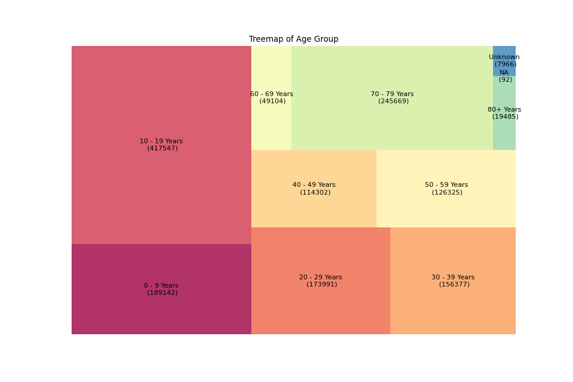
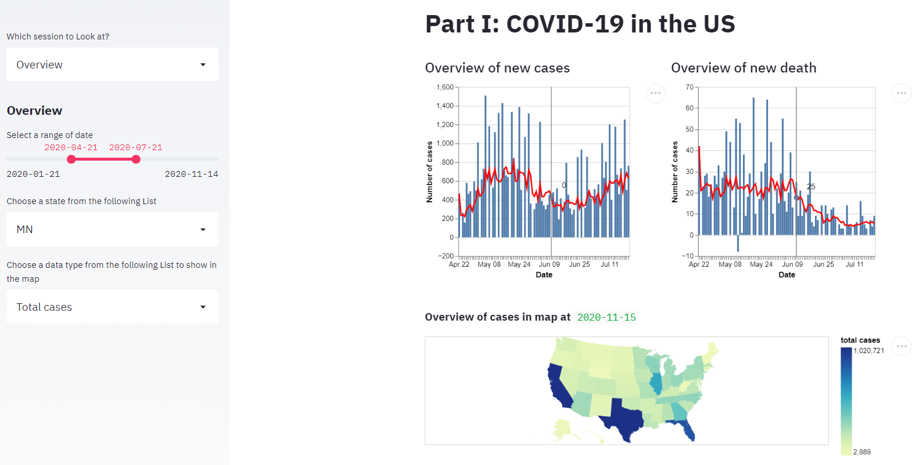
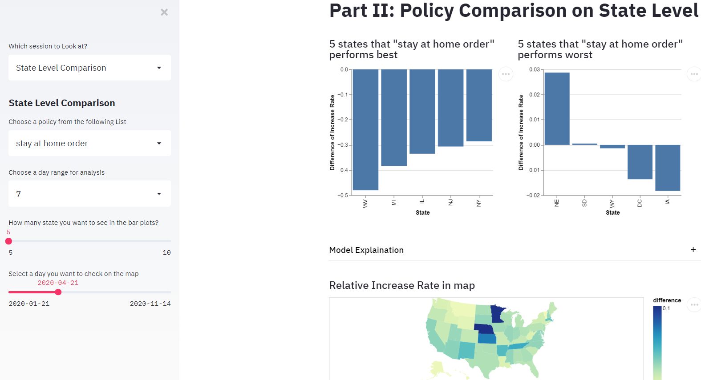
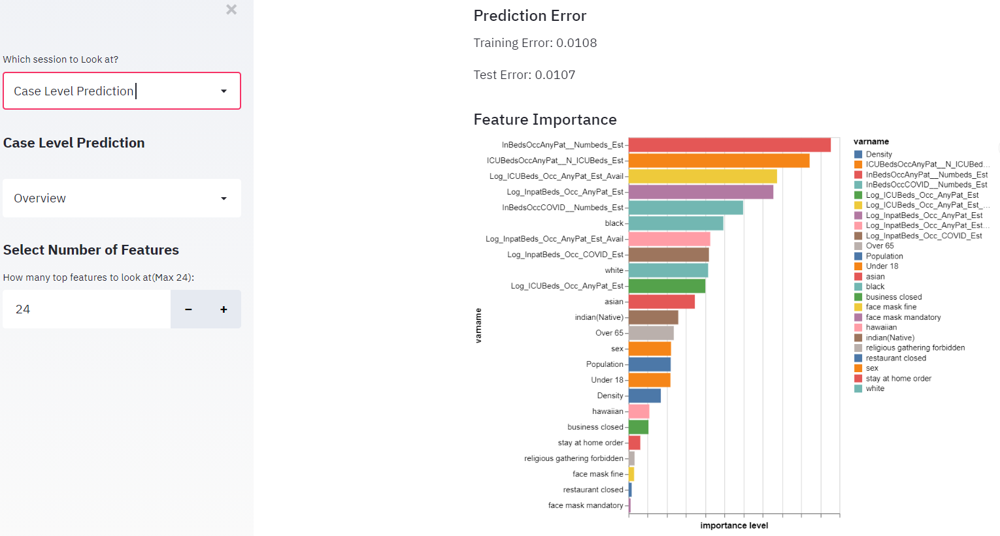
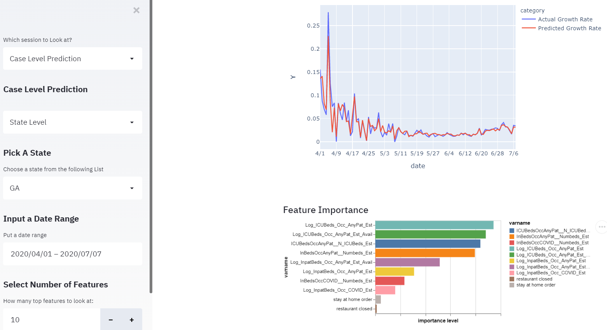
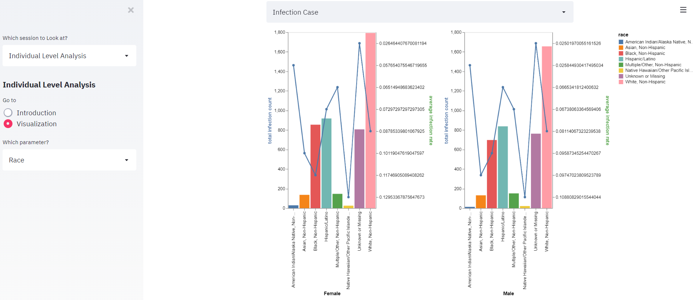

### Project goals

We first discussed the goals of our project and decided to finalize it when we had the data. After the data collection, here are the goals of the project:

- Build machine learning models to predict daily case growth rate

- Explore what factors influence case growth rate

- Explore the effect of Policy

- Analyze what impact infection and death rate from individual case level

- Build a dashboard that provided updated COVID19 information and presents model results

### Data collection and data cleaning

We mainly collected data from US CDC, a policy database supported by researchers in Boston University and US census bureau. Here are the main data resources we used in the project. 

- COVID-19 cases in US from January till now

  https://data.cdc.gov/Case-Surveillance/United-States-COVID-19-Cases-and-Deaths-by-State-o/9mfq-cb36

- COVID-19 patient-level data

  https://data.cdc.gov/Case-Surveillance/COVID-19-Case-Surveillance-Public-Use-Data/vbim-akqf

- hospital resources (Hospital Capacity by State)

  https://www.cdc.gov/nhsn/covid19/report-patient-impact.html#anchor_1594393649

- COVID-19 US State Policy 

  https://github.com/USCOVIDpolicy/COVID-19-US-State-Policy-Database

- State demographic information

  https://www.census.gov/data/developers/data-sets/acs-1year.html

We download all the data through API from the website or just through the URL,  and cleaned the data to make it at least meet the requirement of 1NF. Also, we created a codebook for each dataset.

### Data analysis and Modeling

There are three parts of our analysis:

**1.Comparison of the influence of policies on the increase rate of case among states**

In this part, we try to explore the effectiveness of policies of different states on controlling COVID-19 cases. After discussion, we chose four main policy: **stay at home order, face mask mandatory, restaurant close and business close**. We calculated the average increase rate of total cases on each state 7/15 days before and after the implementation date of the each policy. 7 days represents short term while 15 days represents long term. 

We also compare the state level increase rate and the increase rate of US to asses the performance of the state government. 

**2.Predict Covid19 Case Growth Rate**

Since cases changes as time goes, we first considered LSTM (Long short-term memory) recurrent neural network (RNN) model and time series model, but the results were not good.  Then, we decided only to consider increase rate and several lags instead of new cases to denote the effect of time. After that, we used **random forest** models to train the data and made predictions.

There were two levels of analysis: US level and states level. For US level, we used **hospital capacity data** ( number of inpatient beds, number of ICU beds, etc.), **state demographic information** and **policies** to predict increase rate. For the state level, we only use hospital capacity data and policy data since state demographic information were *constants* for a specific state and would not change over time. We used data before July as training datasets and data after July as test datasets.

The test RMSE (root mean square error) of US level is 0.0107, which is quite low. We also trained a random forest model for each state.

**3.Individual Level Analysis**

Since the original dataset from US CDC has a large number of individual observations (over 5 million), we transformed the data into **SQL database** and performed **stratified sampling** based on the age group (5% of the data). 

The treemap of the original data (we extracted 1.5M observations):

The treemap of the data after sampling:

We can see that we maintained the age structure by this sampling method. Then, we explored how age, sex and race influence the infection cases and fatality cases.

### Data visualization and Development of data product

We used *__streamlit__* to build a dashboard to show our data and analysis results.

There are four parts of the dashboard: 

1.Overview of the COVID-19 cases and death cases by states in US (updated everyday)

- The trend of new cases and new death cases from January till now by state.
- Map plot showing total cases,  new cases, cases per million people, death per million people based the latest data.

2.Comparison of the influence of policies on the increase rate of case among states

- Top 5 states with worse/best policy performance based on 7/15 day ranges
- Map plot showing the relative Increase Rate of individual states compare to the US

3.Predict case growth rate using hospital capacity, state demographic information and related policies based on Random forest.

- Feature Importance plot for the entire U.S. level
- Actual VS Predicted daily case growth rate for each state
- Feature Importance plot for the individual state level
- Pie chart showing state's Sex ratio, race ratio 
- Bar plot of age groups, data table of the state's demographic information 

**US level:**

**State level:**

4.Explore how sex, age race and commodity affect the development of COVID-19 from a individual level
- Sampling process of original data
- Tree plot of data specified by age_group
- Death cases count/rate for each age group; Infection cases count/rate for each age group (faceted by gender)
- Death cases count/rate for each race; Infection cases count/rate for each race (faceted by gender)

### Deployment

We deployed the dashboard at this [GitHub](https://github.com/QianyinLu/finalproject1) .**Our final data product can be access from [here](https://final-project-823.herokuapp.com/)**.

### Some personal thoughts

As the only biostatistics student in the group, I basically contributed to the design of the study since most of other group members didn't have much experience related. Based on my previous experience on epidemiology, for the project goal, I first suggested consider finding risk factors of getting COVID and used the risk factors to adjust cases for each state, then comparing the performance of each state government.  After discussion and data collection, we thought we could do this at both case level and individual level. Specifically, Qianyin suggested that we could consider the effect of policy, which was a perspective that I had never thought about before. **I have really learnt a lot from this interdisciplinary background of the team!**

For the model part, I was not familiar with time series models, while Qianyin and Jishen had some courses related. Their way of converting time-dependent variable to something time-independent  (by using increase rate) really inspired me a lot. Next time, I will be confident to deal with this kind of data since I have learnt a lot from them already.

For the dashboard part, I used dash package for my homework 6, but it was code-heavy. Thus, for this project, I strongly suggested the team to use streamlit since we could spare more time on analysis. Compared with dash, streamlit is less flexible but more user-friendly and easy to pick up. After discussing the code with Qianyin and reading the documents online, I quickly learnt how to code with streamlit and altair (another package to create interactive figures).

In the end, I really want to thank my teammates for their work! 

