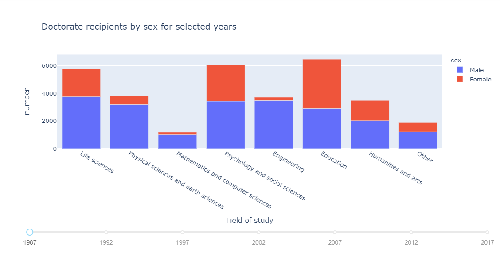
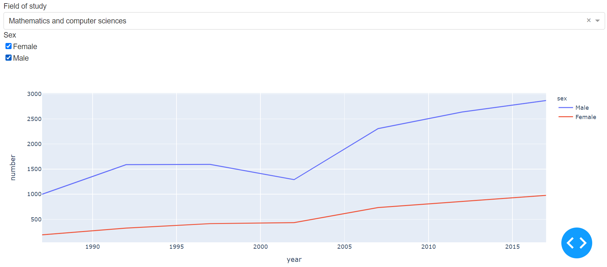
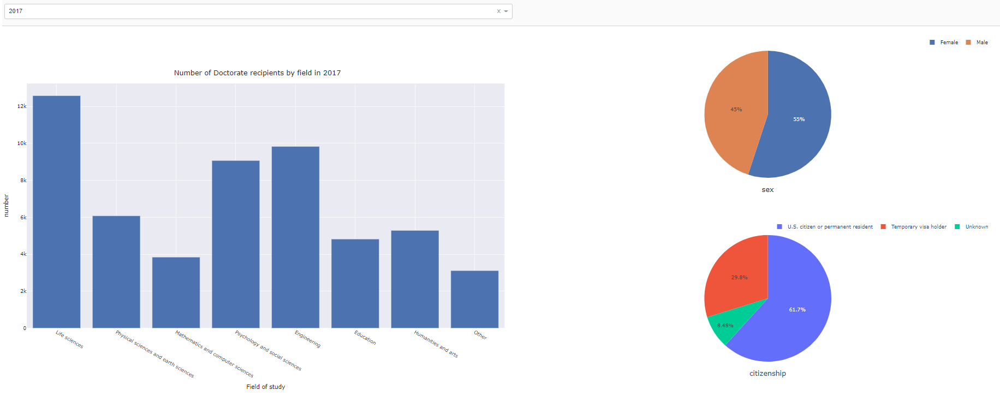

The task is to download data of PhDs awarded in the US. Do some analysis in pandas. Make a dashboard visualization of a few interesting aspects of the data using dash or streamlit.
dataset: https://ncses.nsf.gov/pubs/nsf19301/data

### 1. Read the dataset and data cleaning

For this collection of datasets, I want to explore the number of doctorate recipients by major field of study, sex and citizenship in the selected years from 1987 to 2017. <br>
Thus, I planed to explore table 14 and table 17.


```python
import pandas as pd
import numpy as np
```

#### - Data cleaning for table 14


```python
df1 = pd.read_excel('D:\\3.Duke\\course\\Year_2\\semester_1\\2_Bios823\\HW\\HW6\\data_tables\\sed17-sr-tab014.xlsx')
```

- Choose columnes that we are interested in.


```python
df1 = df1.iloc[7:,[0,1,3,5,7,9,11,13]]   
```


```python
df1.columns = ['Field of study and sex','1987','1992','1997','2002','2007','2012','2017']
```


```python
df1['Field of study and sex'][7] = 'Life sciences'  ## rename some field names
df1['Field of study and sex'][28] = 'Other'
```


```python
df1 = df1.reset_index().drop(columns=['index'])
```


```python
df1['Field of study'] = df1.iloc[::3,0:1]['Field of study and sex'].repeat(repeats = 3).reset_index().drop(columns=['index'])
df1.head()
```


<div>
<style scoped>
    .dataframe tbody tr th:only-of-type {
        vertical-align: middle;
    }


    .dataframe tbody tr th {
        vertical-align: top;
    }
    
    .dataframe thead th {
        text-align: right;
    }

</style>

<table border="1" class="dataframe">
  <thead>
    <tr style="text-align: right;">
      <th></th>
      <th>Field of study and sex</th>
      <th>1987</th>
      <th>1992</th>
      <th>1997</th>
      <th>2002</th>
      <th>2007</th>
      <th>2012</th>
      <th>2017</th>
      <th>Field of study</th>
    </tr>
  </thead>
  <tbody>
    <tr>
      <th>0</th>
      <td>Life sciences</td>
      <td>5783</td>
      <td>7141</td>
      <td>8365</td>
      <td>8465</td>
      <td>10694</td>
      <td>11949</td>
      <td>12587</td>
      <td>Life sciences</td>
    </tr>
    <tr>
      <th>1</th>
      <td>Male</td>
      <td>3747</td>
      <td>4322</td>
      <td>4613</td>
      <td>4443</td>
      <td>5197</td>
      <td>5335</td>
      <td>5629</td>
      <td>Life sciences</td>
    </tr>
    <tr>
      <th>2</th>
      <td>Female</td>
      <td>2036</td>
      <td>2819</td>
      <td>3752</td>
      <td>4022</td>
      <td>5497</td>
      <td>6614</td>
      <td>6958</td>
      <td>Life sciences</td>
    </tr>
    <tr>
      <th>3</th>
      <td>Physical sciences and earth sciences</td>
      <td>3811</td>
      <td>4486</td>
      <td>4522</td>
      <td>3871</td>
      <td>4955</td>
      <td>5414</td>
      <td>6079</td>
      <td>Physical sciences and earth sciences</td>
    </tr>
    <tr>
      <th>4</th>
      <td>Male</td>
      <td>3177</td>
      <td>3545</td>
      <td>3489</td>
      <td>2812</td>
      <td>3447</td>
      <td>3684</td>
      <td>4068</td>
      <td>Physical sciences and earth sciences</td>
    </tr>
  </tbody>
</table>

</div>


- Make the table tidy (into long form)


```python
df2 = pd.melt(df1, id_vars=['Field of study and sex','Field of study'],var_name='year', value_name='number')
```


```python
df2.loc[~df2['Field of study and sex'].isin(['Male','Female']),'Field of study and sex'] = 'All'
df2 = df2.rename(columns={"Field of study and sex": "sex"})
df2["number"] = df2["number"].astype(int)
df2["year"] = df2["year"].astype(int)
df2.head()
```


<div>
<style scoped>
    .dataframe tbody tr th:only-of-type {
        vertical-align: middle;
    }


    .dataframe tbody tr th {
        vertical-align: top;
    }
    
    .dataframe thead th {
        text-align: right;
    }

</style>

<table border="1" class="dataframe">
  <thead>
    <tr style="text-align: right;">
      <th></th>
      <th>sex</th>
      <th>Field of study</th>
      <th>year</th>
      <th>number</th>
    </tr>
  </thead>
  <tbody>
    <tr>
      <th>0</th>
      <td>All</td>
      <td>Life sciences</td>
      <td>1987</td>
      <td>5783</td>
    </tr>
    <tr>
      <th>1</th>
      <td>Male</td>
      <td>Life sciences</td>
      <td>1987</td>
      <td>3747</td>
    </tr>
    <tr>
      <th>2</th>
      <td>Female</td>
      <td>Life sciences</td>
      <td>1987</td>
      <td>2036</td>
    </tr>
    <tr>
      <th>3</th>
      <td>All</td>
      <td>Physical sciences and earth sciences</td>
      <td>1987</td>
      <td>3811</td>
    </tr>
    <tr>
      <th>4</th>
      <td>Male</td>
      <td>Physical sciences and earth sciences</td>
      <td>1987</td>
      <td>3177</td>
    </tr>
  </tbody>
</table>

</div>


- Create a small subset that only contains overall information.


```python
df2a = df2[df2['sex'] == 'All'].reset_index().drop(columns=['index'])
df2a.head()
```


<div>
<style scoped>
    .dataframe tbody tr th:only-of-type {
        vertical-align: middle;
    }


    .dataframe tbody tr th {
        vertical-align: top;
    }
    
    .dataframe thead th {
        text-align: right;
    }

</style>

<table border="1" class="dataframe">
  <thead>
    <tr style="text-align: right;">
      <th></th>
      <th>sex</th>
      <th>Field of study</th>
      <th>year</th>
      <th>number</th>
    </tr>
  </thead>
  <tbody>
    <tr>
      <th>0</th>
      <td>All</td>
      <td>Life sciences</td>
      <td>1987</td>
      <td>5783</td>
    </tr>
    <tr>
      <th>1</th>
      <td>All</td>
      <td>Physical sciences and earth sciences</td>
      <td>1987</td>
      <td>3811</td>
    </tr>
    <tr>
      <th>2</th>
      <td>All</td>
      <td>Mathematics and computer sciences</td>
      <td>1987</td>
      <td>1189</td>
    </tr>
    <tr>
      <th>3</th>
      <td>All</td>
      <td>Psychology and social sciences</td>
      <td>1987</td>
      <td>6063</td>
    </tr>
    <tr>
      <th>4</th>
      <td>All</td>
      <td>Engineering</td>
      <td>1987</td>
      <td>3712</td>
    </tr>
  </tbody>
</table>

</div>


- Create a small subset that contains information by sex.


```python
df2 = (
    df2[df2['sex'].isin(['Male','Female'])].
    reset_index().drop(columns=['index'])
)

df2.head()
```


<div>
<style scoped>
    .dataframe tbody tr th:only-of-type {
        vertical-align: middle;
    }


    .dataframe tbody tr th {
        vertical-align: top;
    }
    
    .dataframe thead th {
        text-align: right;
    }

</style>

<table border="1" class="dataframe">
  <thead>
    <tr style="text-align: right;">
      <th></th>
      <th>sex</th>
      <th>Field of study</th>
      <th>year</th>
      <th>number</th>
    </tr>
  </thead>
  <tbody>
    <tr>
      <th>0</th>
      <td>Male</td>
      <td>Life sciences</td>
      <td>1987</td>
      <td>3747</td>
    </tr>
    <tr>
      <th>1</th>
      <td>Female</td>
      <td>Life sciences</td>
      <td>1987</td>
      <td>2036</td>
    </tr>
    <tr>
      <th>2</th>
      <td>Male</td>
      <td>Physical sciences and earth sciences</td>
      <td>1987</td>
      <td>3177</td>
    </tr>
    <tr>
      <th>3</th>
      <td>Female</td>
      <td>Physical sciences and earth sciences</td>
      <td>1987</td>
      <td>634</td>
    </tr>
    <tr>
      <th>4</th>
      <td>Male</td>
      <td>Mathematics and computer sciences</td>
      <td>1987</td>
      <td>999</td>
    </tr>
  </tbody>
</table>

</div>


#### - Data cleaning for table 17

**The data cleaning for table 17 is similar to that of table 14.**


```python
df4 = pd.read_excel('D:\\3.Duke\\course\\Year_2\\semester_1\\2_Bios823\\HW\\HW6\\data_tables\\sed17-sr-tab017.xlsx')
```


```python
df4 = pd.read_excel('D:\\3.Duke\\course\\Year_2\\semester_1\\2_Bios823\\HW\\HW6\\data_tables\\sed17-sr-tab017.xlsx')
df4 = df4.iloc[7:,:]
df4.columns = ['Field of study and citizenship','1987','1992','1997','2002','2007','2012','2017']
df4['Field of study and citizenship'][7] = 'Life sciences'
df4['Field of study and citizenship'][35] = 'Other'
df4 = df4.reset_index().drop(columns=['index'])
df4['Field of study'] = df4.iloc[::4,0:1]['Field of study and citizenship'].repeat(repeats = 4).reset_index().drop(columns=['index'])
```


```python
df4['Field of study and citizenship'][7] = 'Life sciences'
df4['Field of study and citizenship'][35] = 'Other'
```


```python
df5 = pd.melt(df4, id_vars=['Field of study and citizenship','Field of study'],var_name='year', value_name='number')
df5 = df5.rename(columns={"Field of study and citizenship": "citizenship"})
df5["number"] = df5["number"].astype(int)
df5["year"] = df5["year"].astype(int)
df5 = (
    df5[df5['citizenship'].isin(['U.S. citizen or permanent resident','Temporary visa holder','Unknown'])].
    reset_index().drop(columns=['index'])
)
df5.head()
```


<div>
<style scoped>
    .dataframe tbody tr th:only-of-type {
        vertical-align: middle;
    }


    .dataframe tbody tr th {
        vertical-align: top;
    }
    
    .dataframe thead th {
        text-align: right;
    }

</style>

<table border="1" class="dataframe">
  <thead>
    <tr style="text-align: right;">
      <th></th>
      <th>citizenship</th>
      <th>Field of study</th>
      <th>year</th>
      <th>number</th>
    </tr>
  </thead>
  <tbody>
    <tr>
      <th>0</th>
      <td>U.S. citizen or permanent resident</td>
      <td>Life sciences</td>
      <td>1987</td>
      <td>4529</td>
    </tr>
    <tr>
      <th>1</th>
      <td>Temporary visa holder</td>
      <td>Life sciences</td>
      <td>1987</td>
      <td>939</td>
    </tr>
    <tr>
      <th>2</th>
      <td>Unknown</td>
      <td>Life sciences</td>
      <td>1987</td>
      <td>315</td>
    </tr>
    <tr>
      <th>3</th>
      <td>U.S. citizen or permanent resident</td>
      <td>Physical sciences and earth sciences</td>
      <td>1987</td>
      <td>2657</td>
    </tr>
    <tr>
      <th>4</th>
      <td>Temporary visa holder</td>
      <td>Physical sciences and earth sciences</td>
      <td>1987</td>
      <td>929</td>
    </tr>
  </tbody>
</table>

</div>


### 2. Create dashboard visualizations

__Here I used the dash package to create dashboard in python.__


```python
import plotly.express as px
import jupyter_dash
from jupyter_dash import JupyterDash
import dash_core_components as dcc
import dash_html_components as html
from dash.dependencies import Input, Output
```

- Doctorate recipients by sex for selected years

For this chart, you can drag the slider to change the selected year.


```python
external_stylesheets = ['https://codepen.io/chriddyp/pen/bWLwgP.css']

app = JupyterDash(__name__, external_stylesheets=external_stylesheets)

app.layout = html.Div([
    dcc.Graph(id='graph-with-slider'),
    dcc.Slider(
        id='year-slider',
        min=df2['year'].min(),
        max=df2['year'].max(),
        value=df2['year'].min(),
        marks={str(year): str(year) for year in df2['year'].unique()},
        step=None
    )
])


@app.callback(
    Output('graph-with-slider', 'figure'),
    [Input('year-slider', 'value')])
def update_figure(selected_year):
    filtered_df = df2[df2.year == selected_year]

    fig = px.bar(filtered_df, x="Field of study", y="number", color="sex", 
                 title="Doctorate recipients by sex for selected years")

    fig.update_layout(transition_duration=500)

    return fig

app.run_server(mode='inline',debug=True)
```




- The Trend of number of doctorate recipients by sex from 1987 to 2017

For the chart below, you can play with the dropdown box and checklist to interact with the figure.


```python
external_stylesheets = ['https://codepen.io/chriddyp/pen/bWLwgP.css']

app = JupyterDash(__name__, external_stylesheets=external_stylesheets)

available_fields = df2['Field of study'].unique()

app.layout = html.Div([
              
            html.Label('Field of study'),
            dcc.Dropdown(
                id='Field',
                options=[{'label': i, 'value': i} for i in available_fields],
                value='Life sciences'
            ),
            
            
            html.Label('Sex'),                        
            dcc.Checklist(
                id='sex',
                options=[{'label': i, 'value': i} for i in ['Female', 'Male']],
                value=['Female', 'Male']
            ) ,               
                   
            dcc.Graph(id='fields-graphic'),

])

@app.callback(
    Output('fields-graphic', 'figure'),
    [Input('Field', 'value'),
     Input('sex', 'value')
     ])
def update_graph(field, sex):

    dff = df2[df2['Field of study'] == field]
    
    if sex == []:
        fig = px.line()
    elif (sex == ['Female']) or ( sex == ['Male']) :
        fig = px.line(dff[dff['sex']== sex[0]], x="year", y="number")
    else:
        fig = px.line(dff, x="year", y="number", color='sex')

    
    return fig

app.run_server(mode='inline',debug=True)
```




- Doctorate recipients by major field of study and their according sex and citizenship information summary

The charts below combine all the information in table 14 and table 17. When your mouse **hover** on the bar chart on the left, the sex and citizenship information in the according field will show on the right simultaneously.


```python
external_stylesheets = ['https://codepen.io/chriddyp/pen/bWLwgP.css']
app = JupyterDash(__name__, external_stylesheets=external_stylesheets)

available_years = df2a['year'].unique()

app.layout = html.Div([
    html.Div([

        html.Div([
            dcc.Dropdown(
                id='year',
                options=[{'label': i, 'value': i} for i in available_years],
                value='2017'
            ),
      
        ],
        style={'width': '49%', 'display': 'inline-block'})      
    
    ], style={
        'borderBottom': 'thin lightgrey solid',
        'backgroundColor': 'rgb(250, 250, 250)',
        'padding': '10px 5px'
    }), 
     
    
    html.Div([
        dcc.Graph(
            id='allfield_barchart',
            hoverData={'points': [{'label': 'Life sciences'}]}
        )
    ], style={ 'width': '49%', 'display': 'inline-block', 'padding': '0 20'}),
    
   
    
    
    html.Div([
        dcc.Graph(id='sex-prop'),
        dcc.Graph(id='citizen-prop'),
    ], style={'display': 'inline-block', 'width': '49%'})
    
   
])


@app.callback(
    Output('allfield_barchart', 'figure'),
    [Input('year', 'value')
    ])
def update_graph(year_value):
    
    if year_value == None:
        fig = px.bar()
    else:    
        dff = df2a[df2a['year'] == int(year_value)]
        fig = px.bar(dff, x="Field of study", y="number", template='seaborn',
                    title="Number of Doctorate recipients by field in %s" % year_value)

        fig.update_layout(autosize= True, height=800 ,
                          margin={'l': 20, 'b': 40, 't': 40, 'r': 20}, hovermode='closest')

    return fig

@app.callback(
    Output('sex-prop', 'figure'),
    [Input('allfield_barchart', 'hoverData'),
    Input('year', 'value')
    ])
def update_sex_prop(hoverData, year_value):
    if year_value == None:
        fig = px.pie()
    else: 
        field_name = hoverData['points'][0]['label']
        dff =  df2[ (df2['year'] == int(year_value)) & (df2['Field of study'] == field_name ) ]
    
        #title = '<b>{}</b><br>{}'.format(country_name, xaxis_column_name)
        fig = px.pie(dff, values='number', names='sex',template='seaborn')
        
        fig.update_layout(legend=dict(orientation="h",
        yanchor="bottom",y=1.02,
        xanchor="right",x=1),
        title={'text': "sex",'y':0.1, 'x':0.5})
    
    return fig


@app.callback(
    Output('citizen-prop', 'figure'),
    [Input('allfield_barchart', 'hoverData'),
    Input('year', 'value')
    ])
def update_sex_prop(hoverData, year_value):
    if year_value == None:
        fig = px.pie()
    else: 
        field_name = hoverData['points'][0]['label']
        dff =  df5[ (df5['year'] == int(year_value)) & (df5['Field of study'] == field_name ) ]
    
        #title = '<b>{}</b><br>{}'.format(country_name, xaxis_column_name)
        fig = px.pie(dff, values='number', names='citizenship',template='plotly')
        
        fig.update_layout(legend=dict(orientation="h",
        yanchor="bottom",y=1.02,
        xanchor="right",x=1),
        title={'text': "citizenship",'y':0.1, 'x':0.5})
    
    return fig


app.run_server(mode='inline',debug=True)
```




