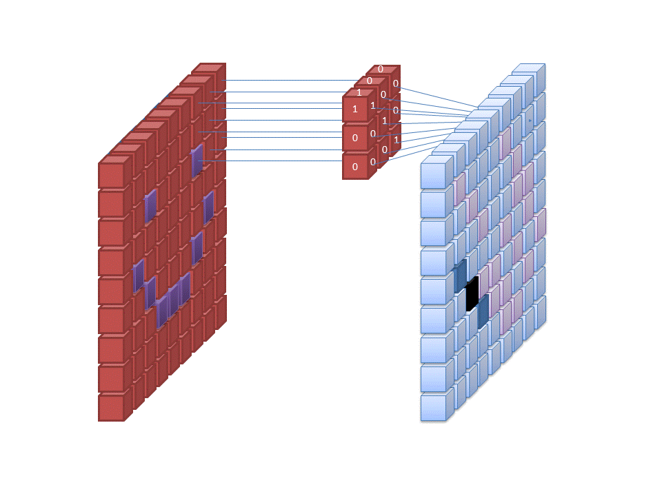
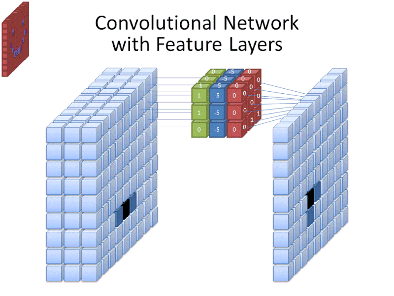
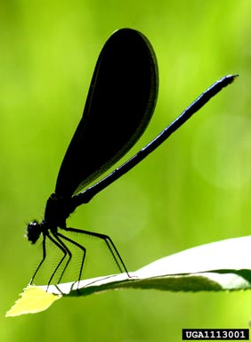
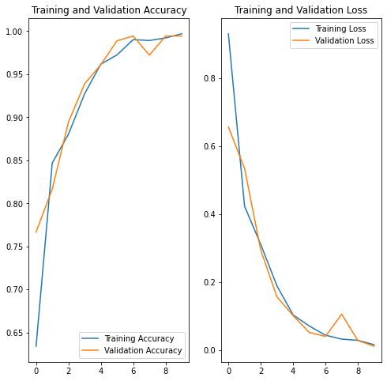

### How the neural network classified the images

Image classification means that we use artificial intelligence (here we use deep learning) to automatically identify objects, people in images, and classify it to different labels.

Images are composed of pixels, and these are the features of the images. Colors could be represented as RGB values (a combination of red, green and blue ranging from 0 to 255). When computer load images, it first convert images into arrays.

Neural network (especially in deep learning) has multiple layers. The first layer usually takes in all the pixels within an image. And then, different filters are applied to the image.



Credit: [commons.wikimedia.org](https://commons.wikimedia.org/wiki/File:Convolutional_Neural_Network_NeuralNetworkFilter.gif)

We use a "convolutional layer" to extracting features from images, that where we have the commonly used term  [Convolutional Neural Network](https://en.wikipedia.org/wiki/Convolutional_neural_network) (CNN) in image classification.



Credit: [commons.wikimedia.org](https://commons.wikimedia.org)

After we extract information from the convolutional layer, we will apply a pooling layer to the matrix. The main idea of "pooling" is to drop out redundant information and avoid overfitting.


The final layer before output is usually a dense layer or a fully connected layer, which is a linear operation on the layer’s input vector.


Credit to:[Stanford CS class](https://cs231n.github.io/neural-networks-1/)

### An example based on insects images

Train a deep learning model to classify beetles, cockroaches and dragonflies using these images(https://www.dropbox.com/s/fn73sj2e6c9rhf6/insects.zip?dl=0). Note: Original images from https://www.insectimages.org/index.cfm. 


### Explore the dataset


```python
# Importing all necessary libraries 
import matplotlib.pyplot as plt
import numpy as np
import os
import PIL
import tensorflow as tf

from tensorflow import keras
from tensorflow.keras import layers
from tensorflow.keras.models import Sequential
```


```python
import pathlib
```


```python
data_train_dir = pathlib.Path('insects\\train')
```


```python
data_test_dir = pathlib.Path('insects\\test')
```


```python
data_train_dir
```


    WindowsPath('C:/your_path/insects/train')


```python
image_count = len(list(data_train_dir.glob('*/*.jpg')))
print(image_count)
```

    1019


```python
image_count = len(list(data_test_dir.glob('*/*.jpg')))
print(image_count)
```

    180


There are 1019 figures for training and 180 figures for testing.<br>
<br>
Let's take a look at the a sample figure.


```python
dragonflies = list(data_train_dir.glob('dragonflies/*'))
PIL.Image.open(str(dragonflies[0]))
```





### Load using keras.preprocessing


```python
img_width, img_height = 256, 224
batch_size = 32
```


```python
train_ds = tf.keras.preprocessing.image_dataset_from_directory(
  data_train_dir,
  image_size=(img_height, img_width),
  batch_size=batch_size)
```

    Found 1019 files belonging to 3 classes.


```python
val_ds = tf.keras.preprocessing.image_dataset_from_directory(
  data_test_dir,
  image_size=(img_height, img_width),
  batch_size=batch_size)
```

    Found 180 files belonging to 3 classes.


```python
class_names = train_ds.class_names
print(class_names)
```

    ['beetles', 'cockroach', 'dragonflies']


```python
for image_batch, labels_batch in train_ds:
    print(image_batch.shape)
    print(labels_batch.shape)
    break
```

    (32, 224, 256, 3)
    (32,)


The image_batch is a tensor of the shape (32, 224, 256, 3). This is a batch of 32 images of shape 224x256x3

### Standardize the data


```python
normalization_layer = layers.experimental.preprocessing.Rescaling(1./255)
```


```python
normalized_ds = train_ds.map(lambda x, y: (normalization_layer(x), y))
image_batch, labels_batch = next(iter(normalized_ds))
first_image = image_batch[0]
# Notice the pixels values are now in `[0,1]`.
print(np.min(first_image), np.max(first_image)) 
```

    0.0 0.9191305


### Create the model


```python
num_classes = 3

model = Sequential([
  layers.experimental.preprocessing.Rescaling(1./255, input_shape=(img_height, img_width, 3)),
  layers.Conv2D(16, 3, padding='same', activation='relu'),
  layers.MaxPooling2D(),
  layers.Conv2D(32, 3, padding='same', activation='relu'),
  layers.MaxPooling2D(),
  layers.Conv2D(64, 3, padding='same', activation='relu'),
  layers.MaxPooling2D(),
  layers.Flatten(),
  layers.Dense(128, activation='relu'),
  layers.Dense(num_classes)
])
```

I choose the optimizers.Adam optimizer and losses.SparseCategoricalCrossentropy loss function. 


```python
model.compile(optimizer='adam',
              loss=tf.keras.losses.SparseCategoricalCrossentropy(from_logits=True),
              metrics=['accuracy'])
```


```python
model.summary()
```

    Model: "sequential"
    _________________________________________________________________
    Layer (type)                 Output Shape              Param #   
    =================================================================
    rescaling_1 (Rescaling)      (None, 224, 256, 3)       0         
    _________________________________________________________________
    conv2d (Conv2D)              (None, 224, 256, 16)      448       
    _________________________________________________________________
    max_pooling2d (MaxPooling2D) (None, 112, 128, 16)      0         
    _________________________________________________________________
    conv2d_1 (Conv2D)            (None, 112, 128, 32)      4640      
    _________________________________________________________________
    max_pooling2d_1 (MaxPooling2 (None, 56, 64, 32)        0         
    _________________________________________________________________
    conv2d_2 (Conv2D)            (None, 56, 64, 64)        18496     
    _________________________________________________________________
    max_pooling2d_2 (MaxPooling2 (None, 28, 32, 64)        0         
    _________________________________________________________________
    flatten (Flatten)            (None, 57344)             0         
    _________________________________________________________________
    dense (Dense)                (None, 128)               7340160   
    _________________________________________________________________
    dense_1 (Dense)              (None, 3)                 387       
    =================================================================
    Total params: 7,364,131
    Trainable params: 7,364,131
    Non-trainable params: 0
    _________________________________________________________________


### Train the model


```python
epochs=10
history = model.fit(
  train_ds,
  validation_data=val_ds,
  epochs=epochs
)
```

    Epoch 1/10
    32/32 [==============================] - 36s 1s/step - loss: 0.9313 - accuracy: 0.6340 - val_loss: 0.6570 - val_accuracy: 0.7667
    Epoch 2/10
    32/32 [==============================] - 37s 1s/step - loss: 0.4232 - accuracy: 0.8469 - val_loss: 0.5344 - val_accuracy: 0.8167
    Epoch 3/10
    32/32 [==============================] - 36s 1s/step - loss: 0.3108 - accuracy: 0.8803 - val_loss: 0.2941 - val_accuracy: 0.8944
    Epoch 4/10
    32/32 [==============================] - 35s 1s/step - loss: 0.1886 - accuracy: 0.9274 - val_loss: 0.1562 - val_accuracy: 0.9389
    Epoch 5/10
    32/32 [==============================] - 36s 1s/step - loss: 0.1031 - accuracy: 0.9617 - val_loss: 0.1012 - val_accuracy: 0.9611
    Epoch 6/10
    32/32 [==============================] - 36s 1s/step - loss: 0.0704 - accuracy: 0.9725 - val_loss: 0.0514 - val_accuracy: 0.9889
    Epoch 7/10
    32/32 [==============================] - 37s 1s/step - loss: 0.0435 - accuracy: 0.9902 - val_loss: 0.0399 - val_accuracy: 0.9944
    Epoch 8/10
    32/32 [==============================] - 38s 1s/step - loss: 0.0319 - accuracy: 0.9892 - val_loss: 0.1055 - val_accuracy: 0.9722
    Epoch 9/10
    32/32 [==============================] - 38s 1s/step - loss: 0.0284 - accuracy: 0.9921 - val_loss: 0.0279 - val_accuracy: 0.9944
    Epoch 10/10
    32/32 [==============================] - 39s 1s/step - loss: 0.0155 - accuracy: 0.9971 - val_loss: 0.0109 - val_accuracy: 0.9944


### Visualize training results


```python
acc = history.history['accuracy']
val_acc = history.history['val_accuracy']

loss = history.history['loss']
val_loss = history.history['val_loss']

epochs_range = range(epochs)

plt.figure(figsize=(8, 8))
plt.subplot(1, 2, 1)
plt.plot(epochs_range, acc, label='Training Accuracy')
plt.plot(epochs_range, val_acc, label='Validation Accuracy')
plt.legend(loc='lower right')
plt.title('Training and Validation Accuracy')

plt.subplot(1, 2, 2)
plt.plot(epochs_range, loss, label='Training Loss')
plt.plot(epochs_range, val_loss, label='Validation Loss')
plt.legend(loc='upper right')
plt.title('Training and Validation Loss')
plt.show()
```





The model achieved quite high accuracy (**99.44%**).

### Save the model


```python
model.save_weights('model_saved.h5')
```

### Reference

1.https://www.tensorflow.org/tutorials/images/classification <br>
2.https://stackabuse.com/image-recognition-in-python-with-tensorflow-and-keras/ <br>
3.https://cs231n.github.io/neural-networks-1/ <br>
4.http://deeplearning.stanford.edu/tutorial/supervised/Pooling/